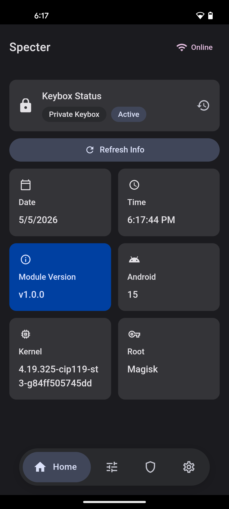
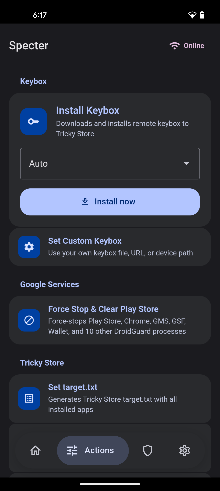
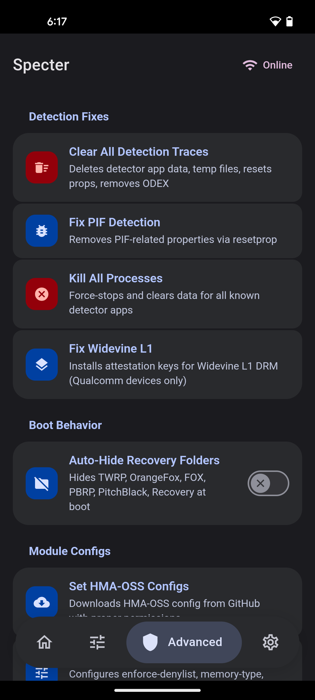
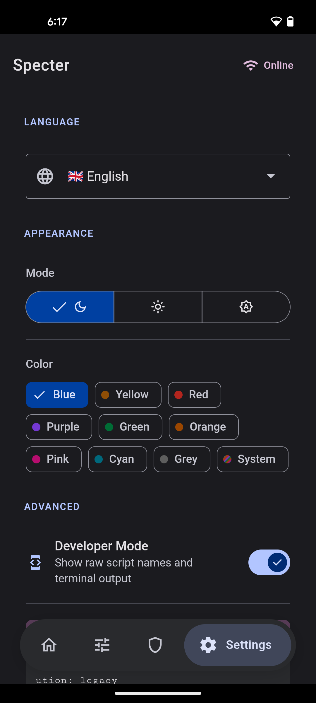

# Specter

<p align="center">
  
  
  
  
</p>

[](https://github.com/dpejoh/specter/releases/latest)
[](https://github.com/dpejoh/specter/actions)

A systemless module to achieve and maintain device integrity - keybox management, security spoofing, and detection avoidance.

[Download](https://github.com/dpejoh/specter/releases/latest)

## Background

Specter is a fork of Yurikey, a project I originally authored. After transferring ownership, the code quality declined and the project shifted away from what it was meant to be - a clean, free module for the community. This fork restores that vision: clean architecture, proper error handling, support for multiple keybox sources, and zero business agenda. Donations are appreciated but never the goal.

---

## How it works

1. Install [Play Integrity Fix](https://github.com/KOWX712/PlayIntegrityFix/releases/latest) or [Play Integrity Fork](https://github.com/osm0sis/PlayIntegrityFork/releases/latest)
2. Install [Tricky Store](https://github.com/5ec1cff/TrickyStore/releases/latest)
3. Install Specter via your root manager (Magisk / KernelSU / APatch)
4. Press the action button or open the WebUI

## Features

- **Keybox management** - multi-source catalog, custom keybox (file/URL/path), Google revocation checking, private keybox support, backup and restore
- **Blacklist** - exclude detector apps from target.txt generation with editable defaults
- **SmartMerge** - per-app targeting control with suffixes (! force, ? conditional, #disable)
- **Security spoofing** - security patch date, verified boot hash, property hardening, delayed re-application (120s), CROM spoof detection
- **Target generation** - dynamic target.txt with fixed + installed app entries
- **PIF integration** - automatic fingerprint updates for INJECT and Fork variants
- **Zygisk Next** - enforce-denylist, memory-type, and linker configuration
- **Widevine L1** - attestation key installation for Qualcomm devices
- **Detection cleanup** - removes traces from common detector apps, DroidGuard process killer
- **RKA** - Remote Key Attestation provisioning for PassIt
- **Boot behavior** - auto-hide recovery folders (TWRP, OrangeFox, etc.) at boot
- **WebUI** - Material 3 TypeScript interface with animated nav, terminal output, developer mode
- **i18n** - 5 languages (en, zh, ru, es, ar)
- **Multi-root** - Magisk / KernelSU / APatch with runtime detection

## Requirements

- Root access (Magisk / KernelSU / APatch)
- Tricky Store module
- Play Integrity Fix or Play Integrity Fork (recommended)

## Build from source

```bash
git clone https://github.com/dpejoh/specter
cd specter
npm install
npm run build
```

Output: `module.zip`

The WebUI is written in TypeScript with strict mode - run the type checker before committing:

```bash
npx tsc --noEmit
```

## License

GNU GPL v3.0
